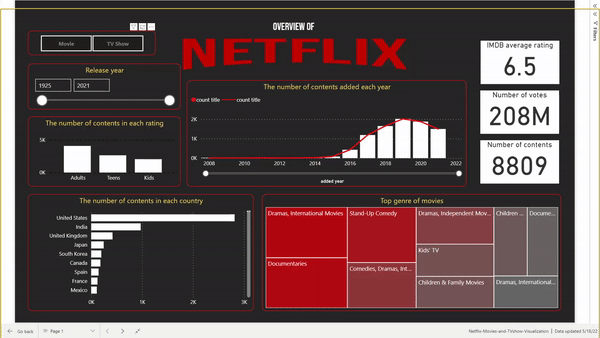

# Netflix-Movies-and-TVshows-Visualization-PowerBI

This is a Power BI project that creates interactive dashboards for Netflix content visual analysis.

## Dataset
we use 2 datasets
* the first one is Netflix Movies and TV Shows on [kaggle](https://www.kaggle.com/datasets/shivamb/netflix-shows) 
* the second one is IMDb score from [IMDb Datasets](https://www.imdb.com/interfaces/) (note that we use title.basics.tsv and title.ratings.tsv)
then we combine it all together using `data_preparation.ipynb` and the final preprocessed data is in `data/netflix_titles_with_IMDB.csv`

## Results
This project depicts 2 story points.
1. an overview of Netflix content \

2. Top IMDB score contents \

You can find it by following Power BI link below.

## Links 
[Power BI dashboard](https://app.powerbi.com/view?r=eyJrIjoiNjlhY2FiMjItNDVkNy00MGNmLWJjOTQtODRhYTEyYzIyOWFiIiwidCI6IjZmNDQzMmRjLTIwZDItNDQxZC1iMWRiLWFjMzM4MGJhNjMzZCIsImMiOjEwfQ%3D%3D) \
Medium (on progress)
